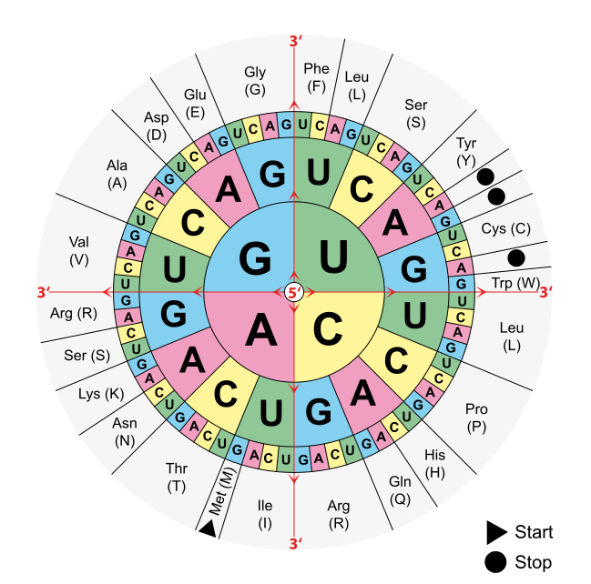

<h1 align="center">Bioinformatics</h1>

## Level 1: Nucleotide bases
- Data from **DNA** or **RNA**.
- 4 letters: **A**, **C**, **G**, **T**
- K-mers: "words" of K-length. Ej. (hexamers), "ATGCATGCA" becomes: ‘ATGCAT’, ‘TGCATG’, ‘GCATGC’, ‘CATGCA’.

## Level 2: Amino acids
- Data from **Proteins**.
- 21 letters: **A**, **R**, **N**, **D**, **C**, **Q**, **E**, **G**, **H**, **I**, **L**, **K**, **M**, **F**, **P**, **S**, **T**, **W**, **Y**, **V**

## Level 3: Domains of proteins

## Level 4: Gen Ontology
- **GO**
- **Uniprot**

## Reactoma
**Grafo de interacción** de proteinas.

## BLAST
Algoritmo que determina el nivel de similaridad de 2 sequecias.

| Nucleutide BLAST | Protein BLAST |
|------------------|---------------|
|  |  |

| Nucleutide BLAST | Protein BLAST |
|------------------|---------------|
|  |  |

---

## DNA as a NLP problem

- **Nucleotide bases** and **amino acids** are characters.
- **K-mers** and peptides (motifs) are words.
- **Genes** and gene families are sentences.

> ### Paper of using Transformer model with DNA:
> **[Biological structure and function emerge from scaling unsupervised learning to 250 million protein sequences](https://doi.org/10.1101/622803)**
>
>  They have trained a neural network that **predicts masked amino acids** on 250 million sequences.  The total number of amino acids has been set at 86 billion. To reach their goal, they used a powerful model architecture called the Transformer.
>
> After training the Transformer algorithm to process amino acid sequences, researchers looked at the embedding learned by the model. Above all, they found out that the neural network had built a complex representation of the input sequences. This in turn reflects their biological properties such as activity, stability, structure, binding etc. In other words, the deep learning algorithm learned important biochemical properties characterising the different amino acids and proteins, all by itself, without any supervision.
>
> Source: https://amethix.com/deep-learning-in-biology

### Python packages
- [biopython](https://biopython.org/)
- [scikit-bio](http://scikit-bio.org/)

### Learn Resources
- [Rosalind](http://rosalind.info)
- [Bioinformatic salgorithms](http://bioinformaticsalgorithms.com)
- [Readiab](http://readiab.org)
