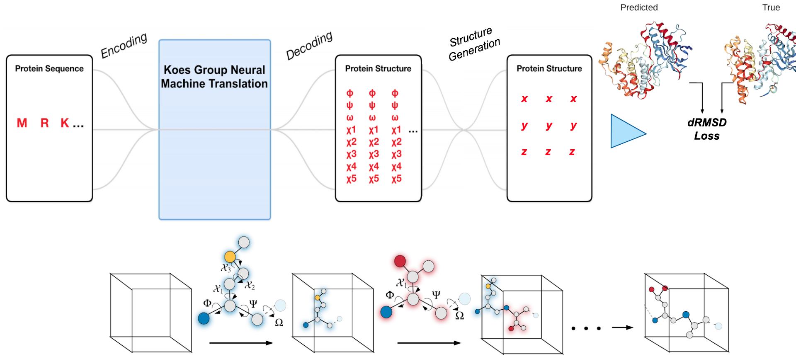
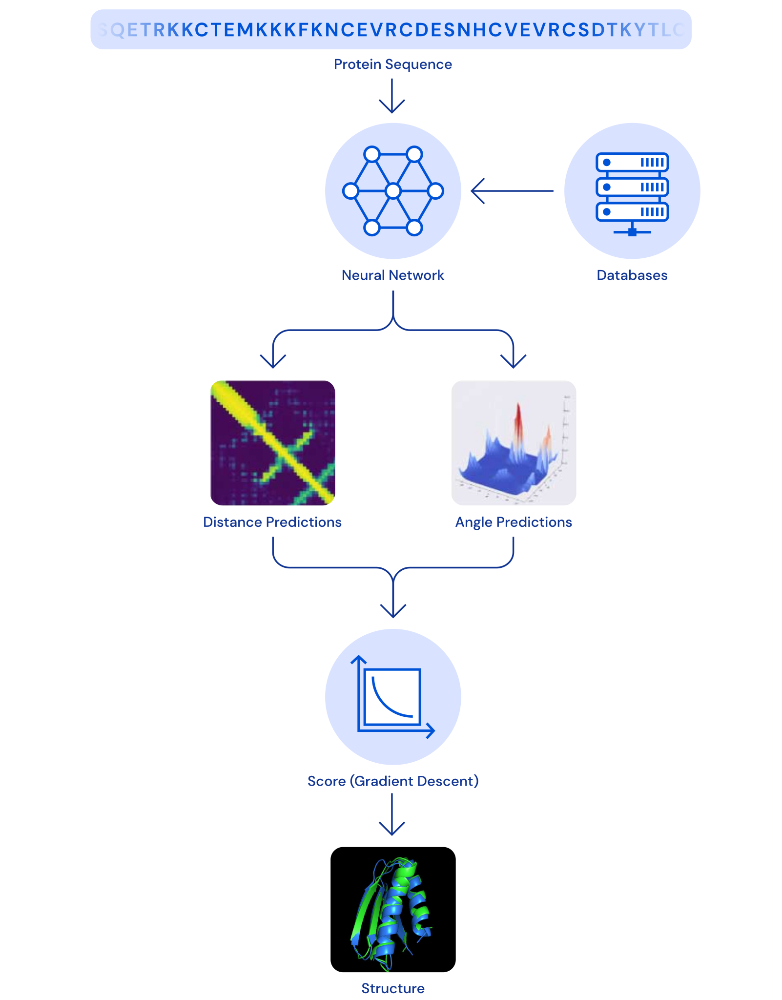

<h1 align="center">Protein Folding</h1>

## Predict dihedral angles
  

## Predict distances
  
- [Accurate De Novo Prediction of Protein Contact Map by Ultra-Deep Learning Model](https://arxiv.org/abs/1609.00680) (2016)

## AlphaFold

AlphaFold predicts both angles and distances

- [AlphaFold](https://deepmind.com/blog/article/AlphaFold-Using-AI-for-scientific-discovery): From seq -> predict 3D shape
  - [Paper in Nature](https://www.nature.com/articles/s41586-019-1923-7.epdf?author_access_token=Z_KaZKDqtKzbE7Wd5HtwI9RgN0jAjWel9jnR3ZoTv0MCcgAwHMgRx9mvLjNQdB2TlQQaa7l420UCtGo8vYQ39gg8lFWR9mAZtvsN_1PrccXfIbc6e-tGSgazNL_XdtQzn1PHfy21qdcxV7Pw-k3htw%3D%3D) (Jan 2020)
  - [Paper in Proteins](https://onlinelibrary.wiley.com/doi/epdf/10.1002/prot.25834) (Sep 2019)

